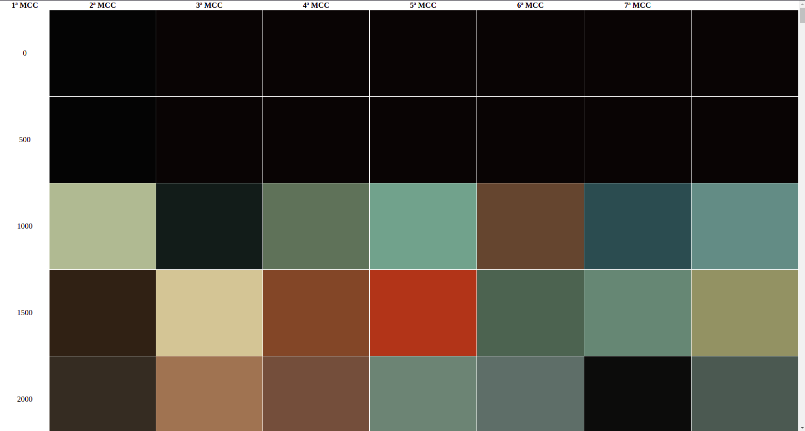

# Frame Analyser

Software para processar um vídeo ou filme e encontrar as cores predominantes.

## Como utilizar

```
usage: main.py [-p PATH] [-f FRAME_PACE] [-n NUM_COR_DOM] [-sb SKIP_BEGINNING]
               [-se SKIP_END] [-c] [-s] [-vi] [-h]

Video Color Analyser.

optional arguments:
  -p PATH, --path PATH  Caminho do arquivo do vídeo
  -f FRAME_PACE, --frame-pace FRAME_PACE
                        Número de frames para pular
  -n NUM_COR_DOM, --num-cor-dom NUM_COR_DOM
                        Número de cores dominantes
  -sb SKIP_BEGINNING, --skip-beginning SKIP_BEGINNING
                        Número de pixels a ignorar no início
  -se SKIP_END, --skip-end SKIP_END
                        Número de pixels a ignorar no final
  -c, --clean-files     Limpar os frames do disco após processar
  -s, --skip-saving     Skip saving images
  -vi, --visualize-img  Visualize image
  -h, --help            Mostra essa mensagem e sai
```

## Formatos de saída

### HTML



### PNG

